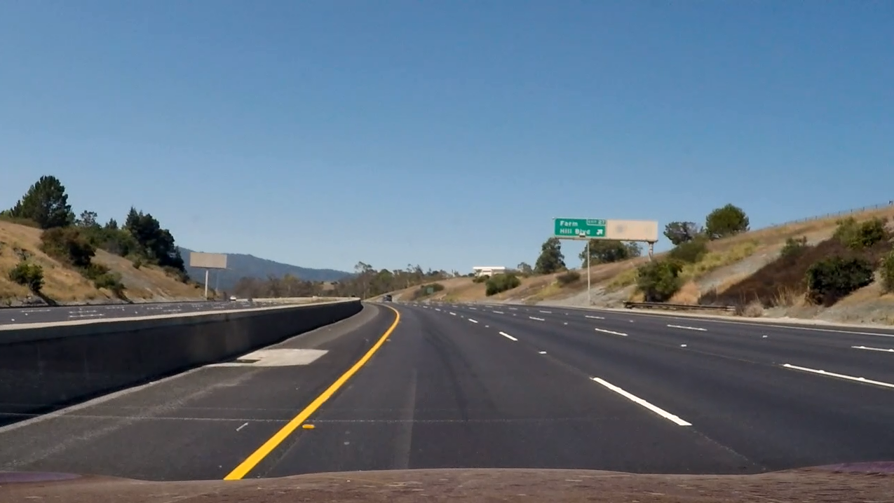
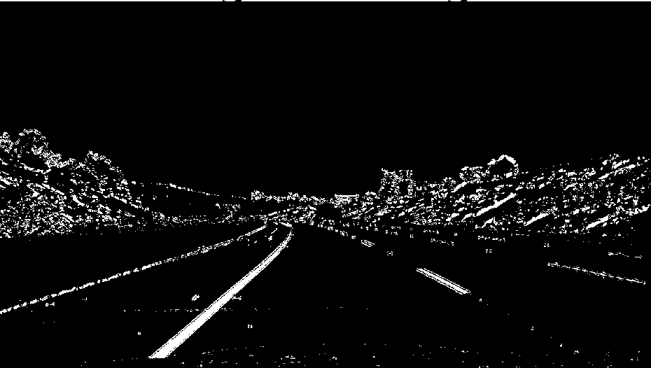
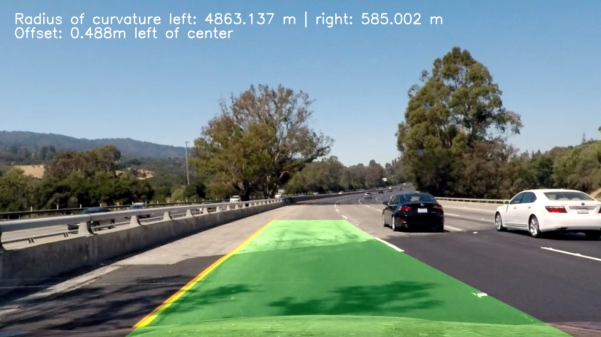

**Advanced Lane Finding Project**

The goals / steps of this project are the following:

* Compute the camera calibration matrix and distortion coefficients given a set of chessboard images.
* Apply a distortion correction to raw images.
* Use color transforms, gradients, etc., to create a thresholded binary image.
* Apply a perspective transform to rectify binary image ("birds-eye view").
* Detect lane pixels and fit to find the lane boundary.
* Determine the curvature of the lane and vehicle position with respect to center.
* Warp the detected lane boundaries back onto the original image.
* Output visual display of the lane boundaries and numerical estimation of lane curvature and vehicle position.

[//]: # (Image References)


[image3]: ./examples/binary_combo_example.jpg "Binary Example"
[image4]: ./examples/warped_straight_lines.jpg "Warp Example"
[image5]: ./examples/color_fit_lines.jpg "Fit Visual"
[image6]: ./examples/example_output.jpg "Output"
[video1]: ./project_video.mp4 "Video"

## [Rubric](https://review.udacity.com/#!/rubrics/571/view) Points
###Here I will consider the rubric points individually and describe how I addressed each point in my implementation.  

---
###Writeup / README

## 1. Briefly state how you computed the camera matrix and distortion coefficients. Provide an example of a distortion corrected calibration image.

The code for this step is contained in the file `camera_cal.py` in the function 'calibrate_camera' (line 38).  

I start by preparing a list of images to calibrate, then I prepared a list of "object points", which will be the (x, y, z) coordinates of the chessboard corners in the world and "imgpoints", which will be the 2d points in image plane. 

Here I am assuming the chessboard is fixed on the (x, y) plane at z=0, such that the object points are the same for each calibration image.  Thus, `objp` is just a replicated array of coordinates, and `objpoints` will be appended with a copy of it every time I successfully detect all chessboard corners in a test image.  `imgpoints` will be appended with the (x, y) pixel position of each of the corners in the image plane with each successful chessboard detection.   

I then used the output `objpoints` and `imgpoints` to compute the camera calibration and distortion coefficients using the `cv2.calibrateCamera()` function. Finally I saved the `objpoints`, `imgpoints`, `mtx` and `dist` in this way we can load it in the future. 

I applied this distortion correction to the test image using the `cv2.undistort()` function and obtained this result: 

<table style="width:100%">
  <tr>
    <th>
      <p align="center">
           
           <br>Chessboard before calibration
      </p>
    </th>
    <th>
      <p align="center">
           
           <br>Chessboard after calibration
      </p>
    </th>
  </tr>
</table>

## Pipeline (single images)

## 1. Provide an example of a distortion-corrected image.
To demonstrate this step, I will describe how I applied the distortion correction to one of the test images like this one:
<p align="center">
  
</p> 

The first step was load the camera matrix and distortion coefficients that I computed in the previous step then the only thing to do is convert the image into grayscale. Doing so, we can undistort the image correctly with the opencv function cv2.undistort. An example of distortion-correction can be found in the next image:
<p align="center">
  
</p> 

The example provided can be found in the file called camera_cal.py

## 2. Describe how (and identify where in your code) you used color transforms, gradients or other methods to create a thresholded binary image.  Provide an example of a binary image result.

I used a combination of color and gradient thresholds to generate a binary image (thresholding steps at lines 23 through 33 in `main.py`). The process that I followed, is the next:
```
    # Apply each of the thresholding functions
    gradx = pre.abs_sobel_thresh(image, orient='x', sobel_kernel=ksize, thresh=(20, 100))
    grady = pre.abs_sobel_thresh(image, orient='y', sobel_kernel=ksize, thresh=(20, 100))
    mag_binary = pre.mag_thresh(image, sobel_kernel=ksize, mag_thresh=(40, 100))
    dir_binary = pre.dir_threshold(image, sobel_kernel=ksize, thresh=(0.7, 1.3))

    #threshold on the saturation channel
    s_threshold = pre.hls_select(image, thresh=(150, 255))        
    
    combined = np.zeros_like(dir_binary)

    combined[(((mag_binary == 1) & (dir_binary == 1))  ) | (s_threshold==1)] = 1
```
First I
then a di
and finally is applied a binary combination between the gradient thresholds and the color threshold.
All the functions that I used are implemented in the file `preprocess.py`.

In the future I would like to improve this part of the project. It is still unclear to me which is the best threshold combination!!

Here's an example of my output for this step. 

<table style="width:100%">
  <tr>
    <th>
      <p align="center">
           
           <br>Original image
      </p>
    </th>
    <th>
    <p align="center">
        
        <br>Binary image
    </p>
    </th>
  </tr>
</table>

This is the best combination that I've obtained (I've tried a lot of combinations...)

## 3. Describe how (and identify where in your code) you performed a perspective transform and provide an example of a transformed image.

The code for my perspective transform is allocated in the file 'warp.py includes a function called `perspective_transform()`, which appears in lines 1 through 49. The `perspective_transform()` function takes as inputs an image (`img`) and returns the image with the perspective transformed and the inverse transformed in order to draw later the road. I chose the hardcode the source and destination points in the following manner:

```
    src = np.float32([[220, 700],
                      [555, 470],
                      [730, 470],
                      [1090, 700]])

    # Choose x positions that allow for 3.7m for the lane position closest to car.
    dst = np.float32([[ 212,  700],
                      [ 212,    0],
                      [ 1086,    0],
                      [ 1086,  700]])

```
This resulted in the following source and destination points:

| Source        | Destination   | 
|:-------------:|:-------------:| 
| 220, 700      | 212, 700      | 
| 555, 470      | 212, 0        |
| 730, 470      | 1086, 0       |
| 1090, 700     | 1086, 700     |

I verified that my perspective transform was working as expected by drawing the `src` and `dst` points onto a test image and its warped counterpart to verify that the lines appear parallel in the warped image as can be seen in the next image.

<table style="width:100%">
  <tr>
    <th>
      <p align="center">
           
      </p>
    </th>
    <th>
      <p align="center">
           
      </p>
    </th>
  </tr>
</table>

## 4. Describe how (and identify where in your code) you identified lane-line pixels and fit their positions with a polynomial?

In the moment in which we have a thresholded warped image we can map the lane lines. The method used in this project is based on the blind search method, this method checks which are the peaks in the histogram of the image, in this way we can detect which pixels belong to the lane.

Then, instead of step through the windows one by one I've implemented the function that find in a margin around the previous line position (based on the course slides!). However, for the sake of simplicity I prefered to use only the previous one, because I did not implemented the sanity check function (I don't want to lose the lane never!)

The code can be found in the file `line_finding.py`, in the function `sliding_line_finding`. An example of this lane lines identification is shown below.
<p align="center">
   
</p>

<p align="center">
   
</p>


## 5. Describe how (and identify where in your code) you calculated the radius of curvature of the lane and the position of the vehicle with respect to center.

I did this in lines 167 through 187 in my code in `line_finding.py`, `function measure_curvature()`.

In order to compute the radius of curvature I've followed the steps detailed in the course, that is,

```
def measure_curvature(binary_warped, left_lane, right_lane):

    left_fit=left_lane.current_fit
    right_fit=right_lane.current_fit
    ploty = np.linspace(0, binary_warped.shape[0]-1, binary_warped.shape[0] )
    y_eval = np.max(ploty)
    ym_per_pix = 30/720 # meters per pixel in y dimension
    xm_per_pix = 3.7/700 # meters per pixel in x dimension
    
    left_fitx = left_fit[0]*ploty**2 + left_fit[1]*ploty + left_fit[2]
    right_fitx = right_fit[0]*ploty**2 + right_fit[1]*ploty + right_fit[2]
    
    # Fit new polynomials to x,y in world space
    left_fit_cr = np.polyfit(ploty*ym_per_pix, left_fitx*xm_per_pix, 2)
    right_fit_cr = np.polyfit(ploty*ym_per_pix, right_fitx*xm_per_pix, 2)

    # Calculate the new radii of curvature
    left_curveradius = ((1 + (2*left_fit_cr[0]*y_eval*ym_per_pix + left_fit_cr[1])**2)**1.5) / np.absolute(2*left_fit_cr[0])
    right_curveradius = ((1 + (2*right_fit_cr[0]*y_eval*ym_per_pix + right_fit_cr[1])**2)**1.5) / np.absolute(2*right_fit_cr[0])
    
    return left_curveradius,right_curveradius
```
In the function `sliding_line_finding` I saved the x and y values for detected line pixels, the only step to do, is fit that points into real world space and then calculate the radius of the curvature.

With the scope to calculate the position of the vehicle with respect to the center, I implemented the following function:
```
def compute_offset(binary_warped, left_lane, right_lane):

    left_fit=left_lane.current_fit
    right_fit=right_lane.current_fit
    ploty = np.linspace(0, binary_warped.shape[0]-1, binary_warped.shape[0] )
    
    left_fitx = left_fit[0]*binary_warped.shape[0]**2 + left_fit[1]*binary_warped.shape[0] + left_fit[2]
    right_fitx = right_fit[0]*binary_warped.shape[0]**2 + right_fit[1]*binary_warped.shape[0] + right_fit[2]
    xm_per_pix = 3.7/700 
    
    #center of the image
    center_img = binary_warped.shape[1]/2

    #cam position respect to the center
    center_cam = (left_fitx+right_fitx)/2
    center_pos = (center_cam-center_img)*xm_per_pix    
    return center_pos
```
The first step is take the center of the image, then it is necessary to compute the average point between the left and right lanes based on the bottom of the image. Finally, I computed the center substracting the last two mentioned values and then I converted into meters as is done in the curveradius function.

## 6. Provide an example image of your result plotted back down onto the road such that the lane area is identified clearly.

I implemented this step following the tips given in the course, the corresponding im in lines 140 through 165 in my code in `line_finding.py` in the function `draw()`. This function paints the region between the lane lines detected.  Then, lines 64 through 70 in my code in `main.py` in the function `process_image_pipeline` the offset and curvature radius are computed. Here is an example of my result on a test image:

<p align="center">
   
</p>

---

###Pipeline (video)

## 1. Provide a link to your final video output.  Your pipeline should perform reasonably well on the entire project video (wobbly lines are ok but no catastrophic failures that would cause the car to drive off the road!).

Here's a [link to my video result](./out_project_video.mp4)

---

###Discussion

## 1. Briefly discuss any problems / issues you faced in your implementation of this project.  Where will your pipeline likely fail?  What could you do to make it more robust?

Firstly, I would like to briefly enumerate the steps that I followed in order to tackle with the project.
1) Calibration & Undistortion
2) Image Binarization (color+gradient thresholding) 
3) Perspective transformation
4) Sliding windows and fit a polynomial in order to detect the lane lines

# Issues and potential problems:
- It was very hard for me to find a good combination of color and gradient threshold for obtaining a binary image, there were moments in the video in which the lanes went out, fortunately it is solved. From my experience this is one of the most important steps in the pipeline.
- I think that, if the video captures frames with noisy lines/lanes, the detection could be bad. It is worth it to mention that, if there are not lane/lines in the road I don't expect nothing good as output :S
- If the car changes the lane there will be moments in which the detection will be bad

# Future Work:
- Implement the sanity check function, i.e, a function that for each frame processed checks if the frame is correct with respect the previous one. With this function will be possible to use correctly the line_finding_after_sliding() function.
- I would like to know which is the best combination of thresholds to obtain the best quality binary image (the binary image that can cover almost all road sceneries).
- I would like also to approach the challenges proposed (unfortunately I have no time, and I would like to cope with the next project before the incoming deadlines).
- Improve and clean the code pipeline and the line class, it would be nice to adapt the line class in order to cover all the mentioned above issues.
