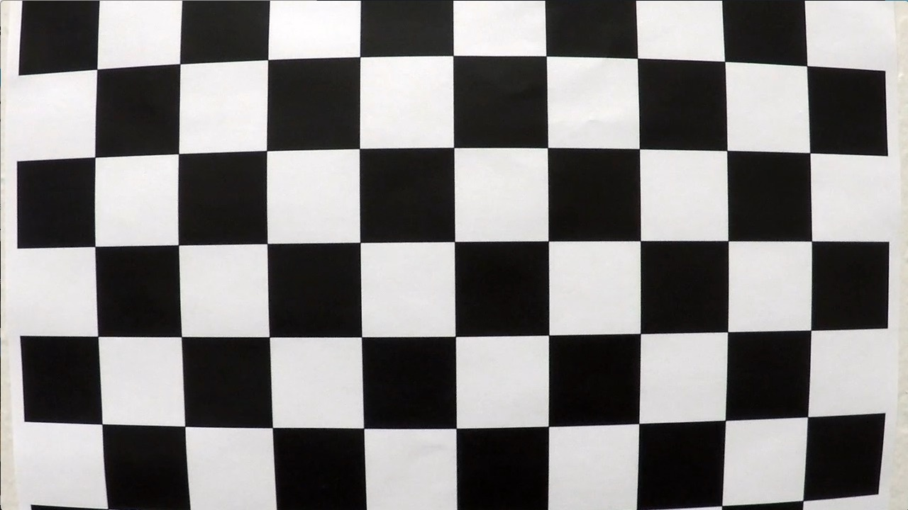

**Advanced Lane Finding Project**

The goals / steps of this project are the following:

* Compute the camera calibration matrix and distortion coefficients given a set of chessboard images.
* Apply a distortion correction to raw images.
* Use color transforms, gradients, etc., to create a thresholded binary image.
* Apply a perspective transform to rectify binary image ("birds-eye view").
* Detect lane pixels and fit to find the lane boundary.
* Determine the curvature of the lane and vehicle position with respect to center.
* Warp the detected lane boundaries back onto the original image.
* Output visual display of the lane boundaries and numerical estimation of lane curvature and vehicle position.

[//]: # (Image References)


[image3]: ./examples/binary_combo_example.jpg "Binary Example"
[image4]: ./examples/warped_straight_lines.jpg "Warp Example"
[image5]: ./examples/color_fit_lines.jpg "Fit Visual"
[image6]: ./examples/example_output.jpg "Output"
[video1]: ./project_video.mp4 "Video"

## [Rubric](https://review.udacity.com/#!/rubrics/571/view) Points
###Here I will consider the rubric points individually and describe how I addressed each point in my implementation.  

---
###Writeup / README

####1. Provide a Writeup / README that includes all the rubric points and how you addressed each one.  You can submit your writeup as markdown or pdf.  [Here](https://github.com/udacity/CarND-Advanced-Lane-Lines/blob/master/writeup_template.md) is a template writeup for this project you can use as a guide and a starting point.  

You're reading it!
###Camera Calibration

####1. Briefly state how you computed the camera matrix and distortion coefficients. Provide an example of a distortion corrected calibration image.

The code for this step is contained in the file `camera_cal.py` in the function 'calibrate_camera' (line 38).  

I start by preparing "object points", which will be the (x, y, z) coordinates of the chessboard corners in the world. Here I am assuming the chessboard is fixed on the (x, y) plane at z=0, such that the object points are the same for each calibration image.  Thus, `objp` is just a replicated array of coordinates, and `objpoints` will be appended with a copy of it every time I successfully detect all chessboard corners in a test image.  `imgpoints` will be appended with the (x, y) pixel position of each of the corners in the image plane with each successful chessboard detection.  

I then used the output `objpoints` and `imgpoints` to compute the camera calibration and distortion coefficients using the `cv2.calibrateCamera()` function.  I applied this distortion correction to the test image using the `cv2.undistort()` function and obtained this result: 

<table style="width:100%">
  <tr>
    <th>
      <p align="center">
           
           <br>Chessboard before calibration
      </p>
    </th>
    <th>
      <p align="center">
           
           <br>Chessboard after calibration
      </p>
    </th>
  </tr>
</table>

###Pipeline (single images)

## 1. Provide an example of a distortion-corrected image.
To demonstrate this step, I will describe how I apply the distortion correction to one of the test images like this one:
<p align="center">
  
</p> 

The first step was load the camera matrix and distortion coefficients that we computed in the previous step. Doing so, we can undistort the image correctly. An example of distortion-correction can be found in the following image:
<p align="center">
  
</p> 


## 2. Describe how (and identify where in your code) you used color transforms, gradients or other methods to create a thresholded binary image.  Provide an example of a binary image result.
I used a combination of color and gradient thresholds to generate a binary image (thresholding steps at lines # through # in `another_file.py`).  Here's an example of my output for this step.  (note: this is not actually from one of the test images)

![alt text][image3]

## 3. Describe how (and identify where in your code) you performed a perspective transform and provide an example of a transformed image.

The code for my perspective transform is allocated in the file 'warp.py includes a function called `perspective_transform()`, which appears in lines 1 through 49. The `perspective_transform()` function takes as inputs an image (`img`) and returns the image with the perspective transformed and the inverse transformed in order to draw later the road. I chose the hardcode the source and destination points in the following manner:

```
    src = np.float32([[220, 700],
                      [555, 470],
                      [730, 470],
                      [1090, 700]])

    # Choose x positions that allow for 3.7m for the lane position closest to car.
    dst = np.float32([[ 212,  700],
                      [ 212,    0],
                      [ 1086,    0],
                      [ 1086,  700]])

```
This resulted in the following source and destination points:

| Source        | Destination   | 
|:-------------:|:-------------:| 
| 220, 700      | 212, 700      | 
| 555, 470      | 212, 0        |
| 730, 470      | 1086, 0       |
| 1090, 700     | 1086, 700     |

I verified that my perspective transform was working as expected by drawing the `src` and `dst` points onto a test image and its warped counterpart to verify that the lines appear parallel in the warped image as can be seen in the next image.

<table style="width:100%">
  <tr>
    <th>
      <p align="center">
           
      </p>
    </th>
    <th>
      <p align="center">
           
      </p>
    </th>
  </tr>
</table>

## 4. Describe how (and identify where in your code) you identified lane-line pixels and fit their positions with a polynomial?

The code can be found in the file `line_finding.py`.
<p align="center">
   
</p>

<p align="center">
   
</p>


## 5. Describe how (and identify where in your code) you calculated the radius of curvature of the lane and the position of the vehicle with respect to center.

I did this in lines 170 through 191 in my code in `line_finding.py`, `function measure_curvature()`.

In order to compute the radius of curvature I've followed the steps detailed in the course, that is,

```
def measure_curvature(binary_warped, left_lane, right_lane):
    ploty = np.linspace(0, binary_warped.shape[0]-1, binary_warped.shape[0] )
    y_eval = np.max(ploty)
    ym_per_pix = 30/720 # meters per pixel in y dimension
    xm_per_pix = 3.7/700 # meters per pixel in x dimension
    
    leftx = left_lane.allx
    lefty = left_lane.ally
    rightx = right_lane.allx
    righty = right_lane.ally
    
    # Fit new polynomials to x,y in world space
    left_fit_cr = np.polyfit(lefty*ym_per_pix, leftx*xm_per_pix, 2)
    right_fit_cr = np.polyfit(righty*ym_per_pix, rightx*xm_per_pix, 2)

    # Calculate the new radii of curvature
    left_curverad = ((1 + (2*left_fit_cr[0]*y_eval*ym_per_pix + left_fit_cr[1])**2)**1.5) / np.absolute(2*left_fit_cr[0])
    right_curverad = ((1 + (2*right_fit_cr[0]*y_eval*ym_per_pix + right_fit_cr[1])**2)**1.5) / np.absolute(2*right_fit_cr[0])
    # Now our radius of curvature is in meters
    curve_radius = round((left_curverad + right_curverad)/2)
```
In the function in charge of find the lanes we saved the x and y values for detected line pixels, then the only step to do, is fit that points into real world space and then calculate the radius of the curvature.

With the scope to calculate the position of the vehicle with respect the center

## 6. Provide an example image of your result plotted back down onto the road such that the lane area is identified clearly.

I implemented this step following the tips given in the course, the corresponding im in lines # through # in my code in `yet_another_file.py` in the function `map_lane()`.  Here is an example of my result on a test image:

![alt text][image6]

---

###Pipeline (video)

####1. Provide a link to your final video output.  Your pipeline should perform reasonably well on the entire project video (wobbly lines are ok but no catastrophic failures that would cause the car to drive off the road!).

Here's a [link to my video result](./project_video.mp4)

---

###Discussion

####1. Briefly discuss any problems / issues you faced in your implementation of this project.  Where will your pipeline likely fail?  What could you do to make it more robust?

Here I'll talk about the approach I took, what techniques I used, what worked and why, where the pipeline might fail and how I might improve it if I were going to pursue this project further.  

